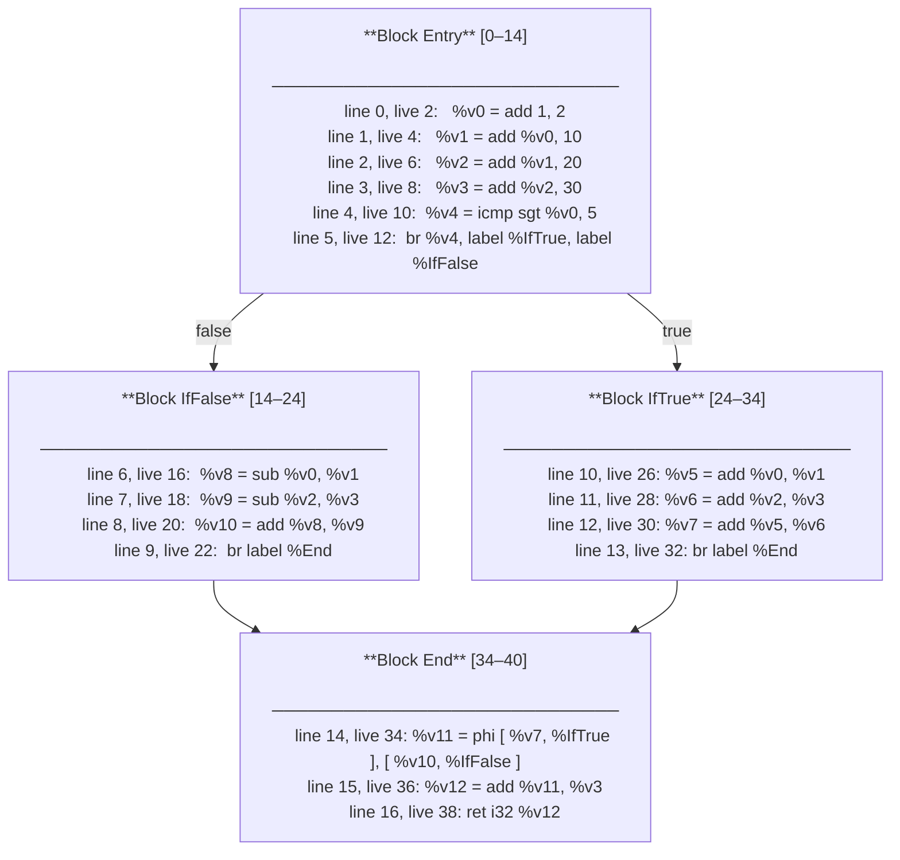
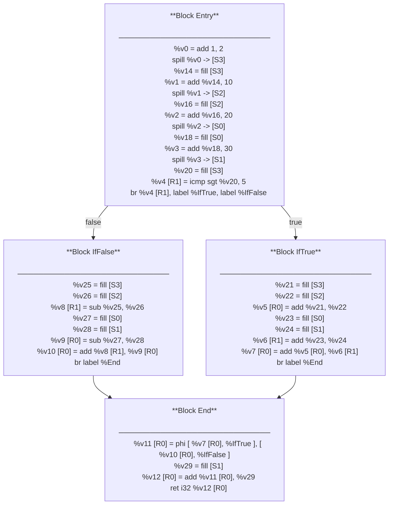
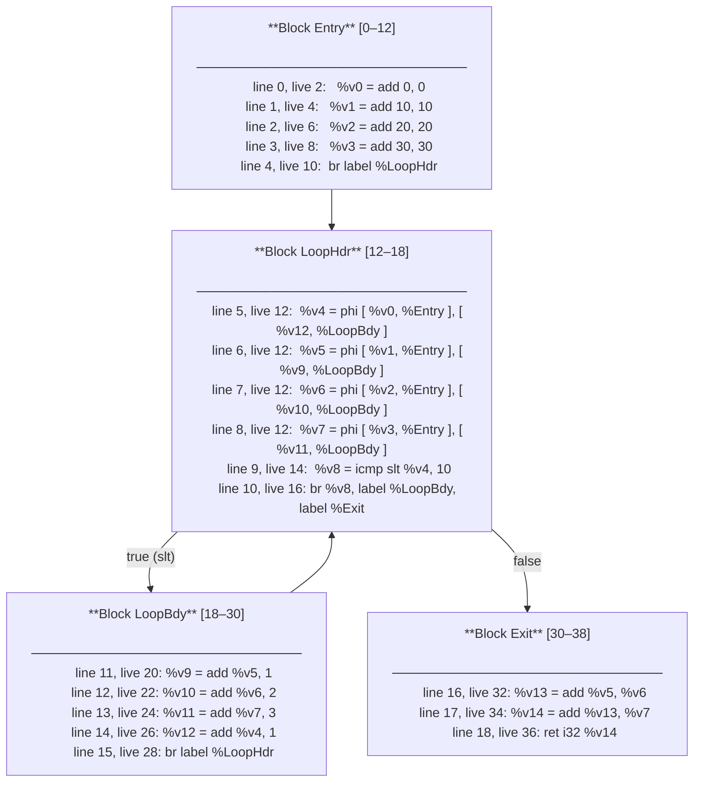
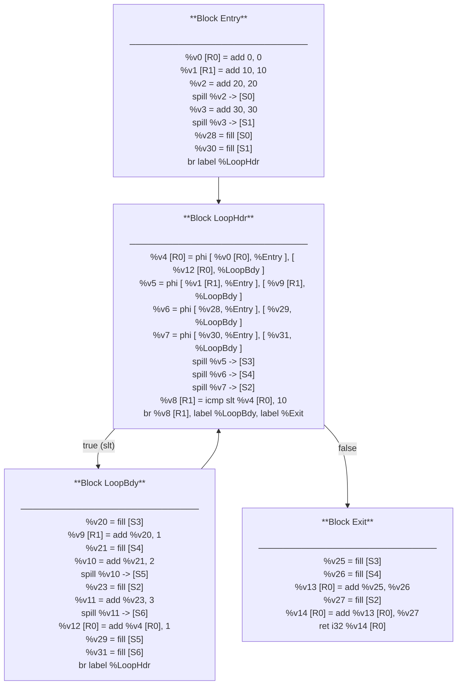
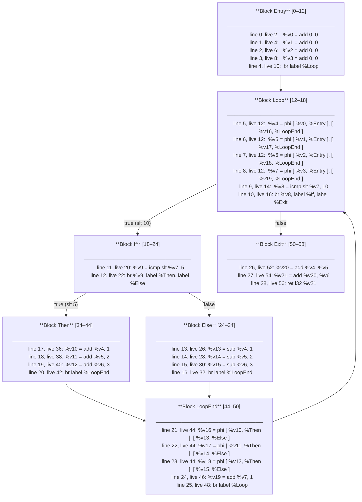
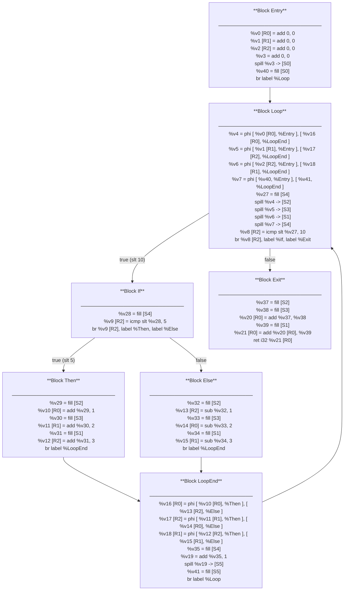

## 1. ConditionalGraph





```
=== Liveness Intervals ===
%v0 : [2, 16) [24, 26) 
%v1 : [4, 16) [24, 26) 
%v2 : [6, 18) [24, 28) 
%v3 : [8, 36) 
%v4 : [10, 12) 
%v5 : [26, 30) 
%v6 : [28, 30) 
%v7 : [30, 34) 
%v8 : [16, 20) 
%v9 : [18, 20)
%v10 : [20, 24) 
%v11 : [34, 36) 
%v12 : [36, 38) 
```

### Table 1 — ConditionalGraph

| Instr | %v0 | %v1 | %v2 | %v3 | %v4 | %v5 | %v6 | %v7 | %v8 | %v9 | %v10 | %v11 | %v12 |
| :---: | :---: | :---: | :---: | :---: | :---: | :---: | :---: | :---: | :---: | :---: | :---: | :---: | :---: |
| 2 | S3 |  |  |  |  |  |  |  |  |  |  |  |  |
| 4 | S3 | S2 |  |  |  |  |  |  |  |  |  |  |  |
| 6 | S3 | S2 | S0 |  |  |  |  |  |  |  |  |  |  |
| 8 | S3 | S2 | S0 | S1 |  |  |  |  |  |  |  |  |  |
| 10 | S3 | S2 | S0 | S1 | R1 |  |  |  |  |  |  |  |  |
| 12 | S3 | S2 | S0 | S1 |  |  |  |  |  |  |  |  |  |
| 14 | S3 | S2 | S0 | S1 |  |  |  |  |  |  |  |  |  |
| 16 |  |  | S0 | S1 |  |  |  |  | R1 |  |  |  |  |
| 18 |  |  |  | S1 |  |  |  |  | R1 | R0 |  |  |  |
| 20 |  |  |  | S1 |  |  |  |  |  |  | R0 |  |  |
| 22 |  |  |  | S1 |  |  |  |  |  |  | R0 |  |  |
| 24 | S3 | S2 | S0 | S1 |  |  |  |  |  |  |  |  |  |
| 26 |  |  | S0 | S1 |  | R0 |  |  |  |  |  |  |  |
| 28 |  |  |  | S1 |  | R0 | R1 |  |  |  |  |  |  |
| 30 |  |  |  | S1 |  |  |  | R0 |  |  |  |  |  |
| 32 |  |  |  | S1 |  |  |  | R0 |  |  |  |  |  |
| 34 |  |  |  | S1 |  |  |  |  |  |  |  | R0 |  |
| 36 |  |  |  |  |  |  |  |  |  |  |  |  | R0 |


---

## 2. SimpleReducibleLoopGraph





```
=== Liveness Intervals ===
%v0 : [2, 12) 
%v1 : [4, 12) 
%v2 : [6, 12) 
%v3 : [8, 12) 
%v4 : [12, 26) 
%v5 : [12, 20) [30, 32) 
%v6 : [12, 22) [30, 32) 
%v7 : [12, 24) [30, 34) 
%v8 : [14, 16) 
%v9 : [20, 30)
%v10 : [22, 30) 
%v11 : [24, 30) 
%v12 : [26, 30) 
%v13 : [32, 34) 
%v14 : [34, 36) 
```

### Table 2 — SimpleReducibleLoopGraph

| Instr | %v0 | %v1 | %v2 | %v3 | %v4 | %v5 | %v6 | %v7 | %v8 | %v9 | %v10 | %v11 | %v12 | %v13 | %v14 |
| :---: | :---: | :---: | :---: | :---: | :---: | :---: | :---: | :---: | :---: | :---: | :---: | :---: | :---: | :---: | :---: |
| 2 | R0 |  |  |  |  |  |  |  |  |  |  |  |  |  |  |
| 4 | R0 | R1 |  |  |  |  |  |  |  |  |  |  |  |  |  |
| 6 | R0 | R1 | S0 |  |  |  |  |  |  |  |  |  |  |  |  |
| 8 | R0 | R1 | S0 | S1 |  |  |  |  |  |  |  |  |  |  |  |
| 10 | R0 | R1 | S0 | S1 |  |  |  |  |  |  |  |  |  |  |  |
| 12 |  |  |  |  | R0 | S3 | S4 | S2 |  |  |  |  |  |  |  |
| 14 |  |  |  |  | R0 | S3 | S4 | S2 | R1 |  |  |  |  |  |  |
| 16 |  |  |  |  | R0 | S3 | S4 | S2 |  |  |  |  |  |  |  |
| 18 |  |  |  |  | R0 | S3 | S4 | S2 |  |  |  |  |  |  |  |
| 20 |  |  |  |  | R0 |  | S4 | S2 |  | R1 |  |  |  |  |  |
| 22 |  |  |  |  | R0 |  |  | S2 |  | R1 | S5 |  |  |  |  |
| 24 |  |  |  |  | R0 |  |  |  |  | R1 | S5 | S6 |  |  |  |
| 26 |  |  |  |  |  |  |  |  |  | R1 | S5 | S6 | R0 |  |  |
| 28 |  |  |  |  |  |  |  |  |  | R1 | S5 | S6 | R0 |  |  |
| 30 |  |  |  |  |  | S3 | S4 | S2 |  |  |  |  |  |  |  |
| 32 |  |  |  |  |  |  |  | S2 |  |  |  |  |  | R0 |  |
| 34 |  |  |  |  |  |  |  |  |  |  |  |  |  |  | R0 |


---

## 3. NestedConditionInsideLoopGraph





```
=== Liveness Intervals ===
%v0 : [2, 12) 
%v1 : [4, 12) 
%v2 : [6, 12) 
%v3 : [8, 12) 
%v4 : [12, 26) [34, 36) [50, 52) 
%v5 : [12, 28) [34, 38) [50, 52) 
%v6 : [12, 30) [34, 40) [50, 54) 
%v7 : [12, 46) 
%v8 : [14, 16) 
%v9 : [20, 22) 
%v10 : [36, 44) 
%v11 : [38, 44) 
%v12 : [40, 44) 
%v13 : [26, 34) 
%v14 : [28, 34) 
%v15 : [30, 34) 
%v16 : [44, 50) 
%v17 : [44, 50) 
%v18 : [44, 50) 
%v19 : [46, 50) 
%v20 : [52, 54) 
%v21 : [54, 56) 
```

### Table 3 — NestedConditionInsideLoopGraph

| Instr | %v0 | %v1 | %v2 | %v3 | %v4 | %v5 | %v6 | %v7 | %v8 | %v9 | %v10 | %v11 | %v12 | %v13 | %v14 | %v15 | %v16 | %v17 | %v18 | %v19 | %v20 | %v21 |
| :---: | :---: | :---: | :---: | :---: | :---: | :---: | :---: | :---: | :---: | :---: | :---: | :---: | :---: | :---: | :---: | :---: | :---: | :---: | :---: | :---: | :---: | :---: |
| 2 | R0 |  |  |  |  |  |  |  |  |  |  |  |  |  |  |  |  |  |  |  |  |  |
| 4 | R0 | R1 |  |  |  |  |  |  |  |  |  |  |  |  |  |  |  |  |  |  |  |  |
| 6 | R0 | R1 | R2 |  |  |  |  |  |  |  |  |  |  |  |  |  |  |  |  |  |  |  |
| 8 | R0 | R1 | R2 | S0 |  |  |  |  |  |  |  |  |  |  |  |  |  |  |  |  |  |  |
| 10 | R0 | R1 | R2 | S0 |  |  |  |  |  |  |  |  |  |  |  |  |  |  |  |  |  |  |
| 12 |  |  |  |  | S2 | S3 | S1 | S4 |  |  |  |  |  |  |  |  |  |  |  |  |  |  |
| 14 |  |  |  |  | S2 | S3 | S1 | S4 | R2 |  |  |  |  |  |  |  |  |  |  |  |  |  |
| 16 |  |  |  |  | S2 | S3 | S1 | S4 |  |  |  |  |  |  |  |  |  |  |  |  |  |  |
| 18 |  |  |  |  | S2 | S3 | S1 | S4 |  |  |  |  |  |  |  |  |  |  |  |  |  |  |
| 20 |  |  |  |  | S2 | S3 | S1 | S4 |  | R2 |  |  |  |  |  |  |  |  |  |  |  |  |
| 22 |  |  |  |  | S2 | S3 | S1 | S4 |  |  |  |  |  |  |  |  |  |  |  |  |  |  |
| 24 |  |  |  |  | S2 | S3 | S1 | S4 |  |  |  |  |  |  |  |  |  |  |  |  |  |  |
| 26 |  |  |  |  |  | S3 | S1 | S4 |  |  |  |  |  | R2 |  |  |  |  |  |  |  |  |
| 28 |  |  |  |  |  |  | S1 | S4 |  |  |  |  |  | R2 | R0 |  |  |  |  |  |  |  |
| 30 |  |  |  |  |  |  |  | S4 |  |  |  |  |  | R2 | R0 | R1 |  |  |  |  |  |  |
| 32 |  |  |  |  |  |  |  | S4 |  |  |  |  |  | R2 | R0 | R1 |  |  |  |  |  |  |
| 34 |  |  |  |  | S2 | S3 | S1 | S4 |  |  |  |  |  |  |  |  |  |  |  |  |  |  |
| 36 |  |  |  |  |  | S3 | S1 | S4 |  |  | R0 |  |  |  |  |  |  |  |  |  |  |  |
| 38 |  |  |  |  |  |  | S1 | S4 |  |  | R0 | R1 |  |  |  |  |  |  |  |  |  |  |
| 40 |  |  |  |  |  |  |  | S4 |  |  | R0 | R1 | R2 |  |  |  |  |  |  |  |  |  |
| 42 |  |  |  |  |  |  |  | S4 |  |  | R0 | R1 | R2 |  |  |  |  |  |  |  |  |  |
| 44 |  |  |  |  |  |  |  | S4 |  |  |  |  |  |  |  |  | R0 | R2 | R1 |  |  |  |
| 46 |  |  |  |  |  |  |  |  |  |  |  |  |  |  |  |  | R0 | R2 | R1 | S5 |  |  |
| 48 |  |  |  |  |  |  |  |  |  |  |  |  |  |  |  |  | R0 | R2 | R1 | S5 |  |  |
| 50 |  |  |  |  | S2 | S3 | S1 |  |  |  |  |  |  |  |  |  |  |  |  |  |  |  |
| 52 |  |  |  |  |  |  | S1 |  |  |  |  |  |  |  |  |  |  |  |  |  | R0 |  |
| 54 |  |  |  |  |  |  |  |  |  |  |  |  |  |  |  |  |  |  |  |  |  | R0 |